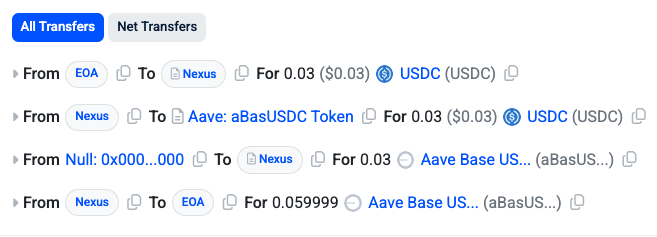

# Biconomy MEE Demo
Experience the future of blockchain execution with this demo showcasing the **Biconomy MEE (Modular Execution Environment)**—the ultimate onchain execution stack that enables single-signature, multichain orchestration.

MEE breaks free from the traditional "one signature, one transaction" limitation by introducing **supertransactions**: complex, multichain sequences that execute with just ONE user signature.

In this demo, we'll demonstrate this revolutionary capability by minting AUSDC from AAVE across multiple transaction steps, all while using USDC for gas payment—no ETH required.

## Setup
### Spinning up a local development network
First, please make sure you have installed foundry and anvil. ([how?](https://book.getfoundry.sh/getting-started/installation))

Then let's fork the Base mainnet as our local development network. The RPC should support `debug_traceCall`. It's recommended to use an RPC with an API key to avoid rate limiting.
```
anvil --fork-url https://base-mainnet.g.alchemy.com/v2/<api_key>
```

We will see a list of anvil prefunded accounts, and we'll use the first one as our MEE account that will initiate the supertransaction. More details are provided in the [Starting the MEE node](#starting-the-mee-node) section.

### Funding the EOA account
Go to [etherscan](https://basescan.org/token/0x833589fcd6edb6e08f4c7c32d4f71b54bda02913#balances) and select a lucky user whose USDC we will "borrow".

Save the addresses into environment variables. In this example, we'll select the Kucoin wallet as our lucky user:
```
export MY_EOA=<your EOA address>
export LUCKY_USER=0xD6216fC19DB775Df9774a6E33526131dA7D19a2c  # kucoin wallet
export TRANSFER_AMOUNT=10000000000                            # we will transfer 10,000 USDC to our EOA (6 decimals)
```

#### option 1: automated funding
Fund the EOA account with USDC:
```
bun fund-eoa
```

#### option 2: manual funding
If you are interested in what's happening behind the scenes, here are the manual steps:

Check the balance of the lucky user to ensure there is plenty of USDC:
```
cast call $USDC "balanceOf(address)(uint256)" $LUCKY_USER
```

Impersonate the lucky user so we can send transactions from their account:
```
cast rpc anvil_impersonateAccount $LUCKY_USER
```

Send 10,000 USDC to our EOA account:
```
cast send $USDC                     \
  --unlocked                        \
  --from $LUCKY_USER                \
  "transfer(address,uint256)(bool)" \
  $MY_EOA                           \
  10000000000
```

Check the balance of our EOA account to confirm we received the USDC:
```
cast call $USDC "balanceOf(address)(uint256)" $MY_EOA
```

### Starting the MEE node
[MEE node](https://docs.biconomy.io/explained/mee#the-power-of-mee-nodes) is a highly intelligent transaction conductor that will orchestrate the flow for our supertransaction.

We'll start the node using docker compose. This account is responsible for initiating the actual transactions and, in return, will receive gas payment from the EOA.

Remove old stuff to have a clean start:
```
docker compose down -v
```

Start our MEE node:
```
docker compose up [-d]
```

#### check the health of the node
Although there is a built-in health check in the docker compose, let's double-check the node is healthy before we proceed:
```
curl -s http://localhost:3000/v3/info | jq '.supportedChains'
```
We should see `"status": "healthy"` for the Base chain. It's okay if Ethereum is not healthy with "native coin balance too low", since Ethereum is only used for price fetching—we won't actually send transactions on it.

Also, we can directly check the health of the node:
```
docker inspect $(docker-compose ps -q node) --format='{{.State.Health.Status}}'
```

#### A few more details
The chain configurations are in the [chains](./chains) folder. In this demo, the node will only support Base (where our transactions will be sent) and Ethereum (for price fetching).

In the chain configuration file, we should put `http://host.docker.internal:8545` as the RPC URL for the Base chain, since we want transactions to occur on our local anvil fork. And for the Ethereum chain, it's recommended to use an RPC with an API key to avoid rate limiting.

In the docker compose file, we did a couple of things:
  - set the private key of the MEE account with `KEY=0xac097....ff80`, so it can sign transactions. In this demo, we use the first anvil prefunded account.
  - mounted our `chains` folder to the container with `./chains:/usr/src/app/chains`, so the node can read the chain configurations.
  - disabled data caching, since we are using a local development network (that restarts often). This can potentially avoid some unexpected errors.

## Running the demo
Now that we have the local development network and the MEE node running, we can start the entire flow!

First, we need to set the private key of our EOA account in the environment variable `KEY` in the `.env` file:
```
KEY=<eoa_private_key>
```

Then we can start the flow:
```
bun install
bun start
```

Several things will happen in the background:
- build the `supertransaction` data using the abstractjs SDK
- quote the execution fee from the MEE node
- sign the `supertransaction` using our EOA account key
- the MEE account will collect the fee (as quoted) and initiate the `supertransaction`
- wait for the `supertransaction` to be confirmed, and AUSDC will magically arrive in our EOA account!

The `supertransaction` is composed of several transactions under the hood:
- transfer USDC from EOA to the nexus account
- approve AAVE to spend USDC from the nexus account
- nexus account supplies USDC to AAVE and receives AUSDC
- transfer AUSDC from nexus to EOA

## Conclusion
🎉 Congratulations! You have successfully executed a sequence of transactions with only **ONE** signature, powered by the Biconomy MEE stack!

As a bonus step, you can try sending a supertransaction on mainnet, where there are more infrastructures available to analyze and visualize the transactions. For example, when sending similar transactions on Base mainnet, we can visualize the token flow on [etherscan](https://basescan.org/tx/0x4f2a21a33bd544934ab1dae870c0bbb43506363c479197244f0960cab7700fd3) or see transaction details on [MEE explorer](https://meescan.biconomy.io)!



## For Developers
If you want to debug or dive into the code, you can run debug mode with the [debug config](./.vscode/launch.json).

If you need to run the MEE Nodes in production, please add all supported chains, and point their RPC to the public RPC. Also, please don't put the private key in the docker compose file, and use the environment variable instead.

## More References
- [Biconomy docs](https://docs.biconomy.io/about)
- [Biconomy network light paper](https://blog.biconomy.io/biconomy-network-litepaper/)
- [abstractjs SDK](https://github.com/bcnmy/abstractjs)

## Notes
I have put the procedure, questions, and challenges in the [notes.md](./notes.md) file, which also includes some of my thoughs and inspirations during the development.